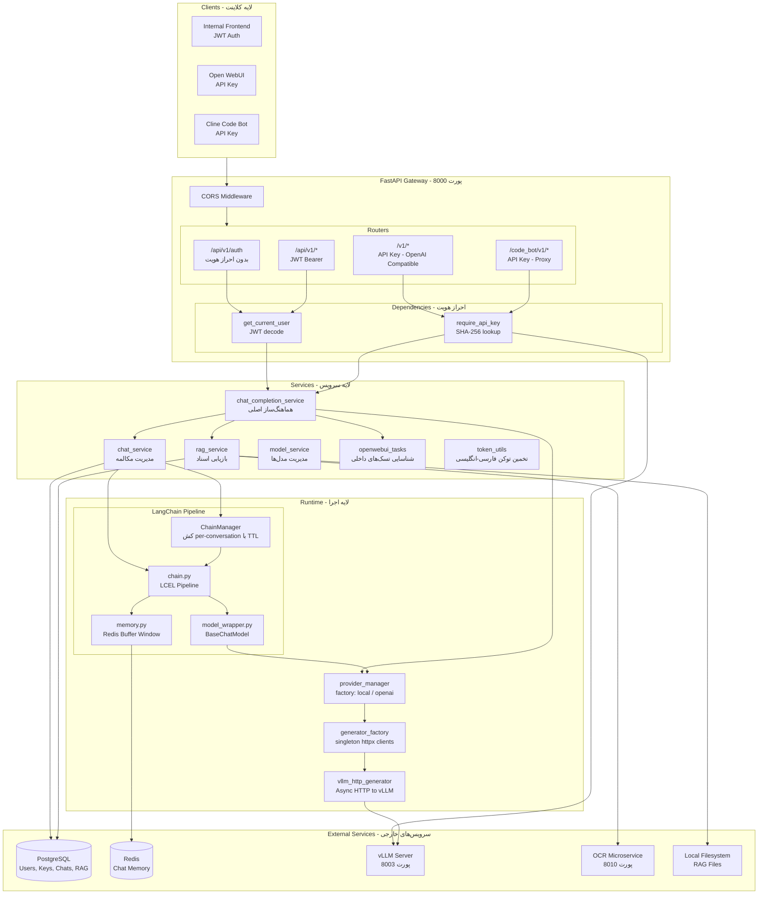
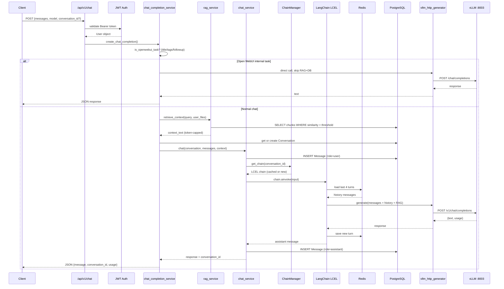
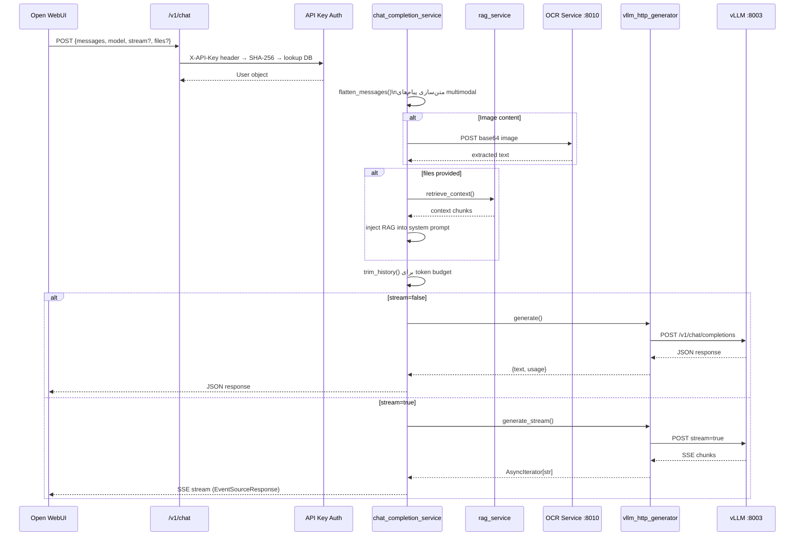
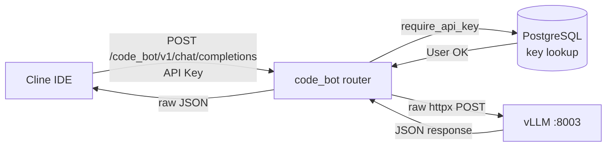
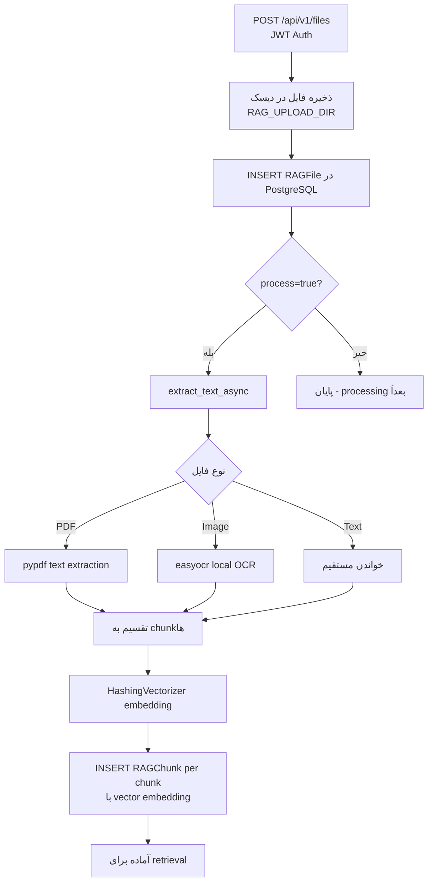
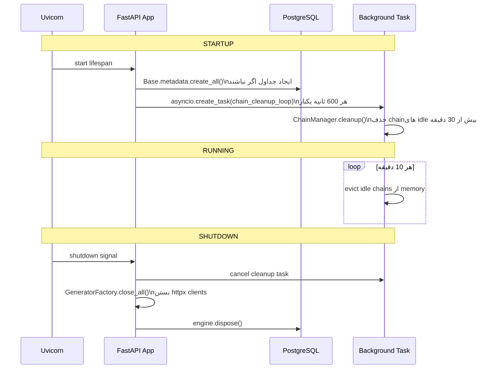
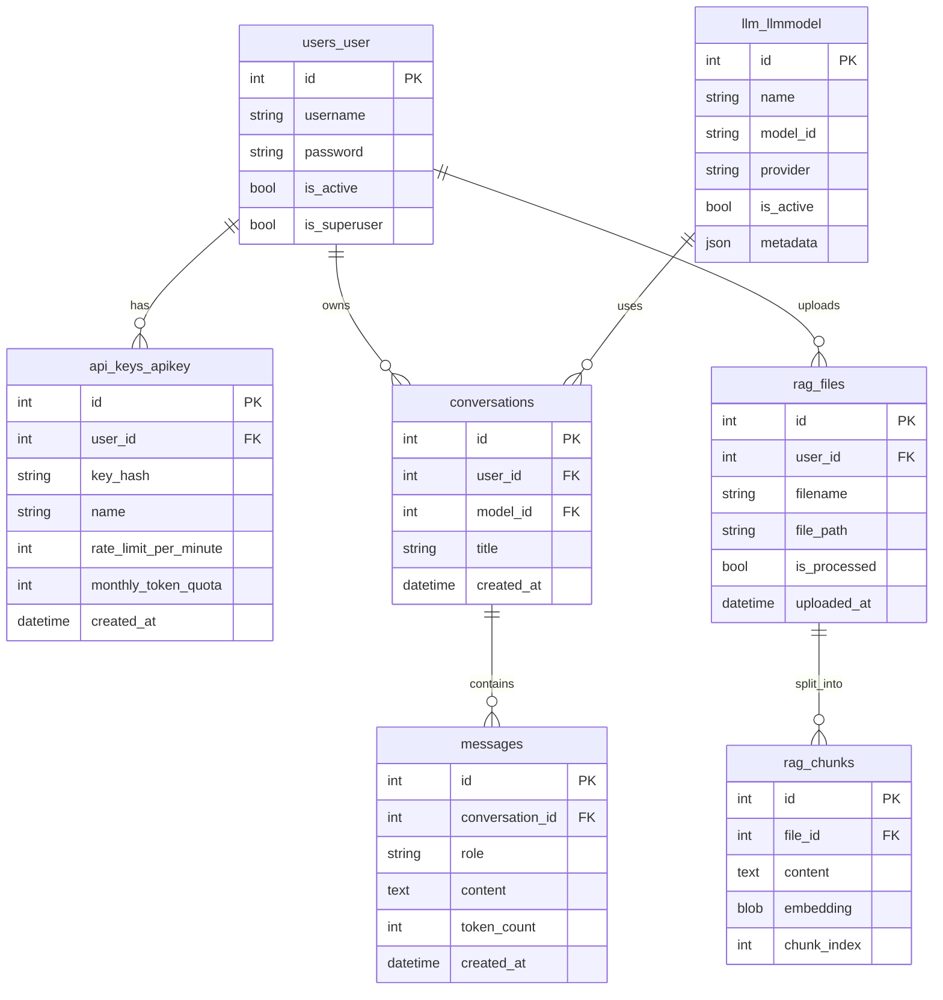
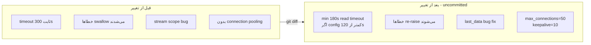

# معماری و جریان کاری پروژه llm_fastapi

## خلاصه پروژه

یک **LLM API Gateway** ناهمزمان (async) بر پایه FastAPI است که سه سطح سرویس‌دهی مجزا دارد، به یک سرور vLLM محلی متصل است، و از PostgreSQL + Redis به‌عنوان لایه داده استفاده می‌کند. پروژه از یک Django monolith مهاجرت کرده و رد پای آن در نام جداول (`users_user`, `api_keys_apikey`) هنوز باقیست.

---

## Stack فناوری

- **Web Framework:** FastAPI + Uvicorn (ASGI، کاملاً async)
- **ORM:** SQLAlchemy 2.0 async + asyncpg → PostgreSQL
- **Auth:** JWT (`python-jose`) + SHA-256 API Key + legacy Django PBKDF2
- **LLM Orchestration:** LangChain LCEL (برای مسیر داخلی)
- **Chat Memory:** Redis (LangChain buffer window k=4)
- **LLM Inference:** vLLM (OpenAI-compatible HTTP)
- **RAG:** sklearn HashingVectorizer + pypdf + easyocr
- **HTTP Client:** httpx (async, connection pooling)

---

## معماری لایه‌بندی شده

---

## جریان کاری چهار مسیر اصلی

### مسیر A — چت داخلی با حافظه و RAG

این مسیر کامل‌ترین مسیر است. از JWT auth، LangChain chain، Redis memory، RAG، و PostgreSQL استفاده می‌کند.

### مسیر B — OpenAI-Compatible API (بدون حافظه)

### مسیر C — Code Bot Proxy (بدون واسطه)

بدون RAG، بدون DB tracking، بدون LangChain — مستقیم‌ترین مسیر.

### مسیر D — RAG File Ingestion

---

## چرخه عمر برنامه (Lifespan)

---

## مدل داده (ERD)

---

## نقاط قوت و ضعف معماری

**نقاط قوت:**
- کاملاً async — بدون blocking thread
- سه سطح سرویس با احراز هویت مستقل
- Provider abstraction — تعویض راحت vLLM با OpenAI
- Singleton cache برای httpx clients و LangChain chains
- RAG با fair-share round-robin و token budget

**نقاط ضعف / بدهی فنی:**
- `create_all` در startup به جای Alembic migrations (versions خالی)
- Rate limiting و quota ذخیره‌سازی می‌شود اما **اعمال نمی‌شود**
- Chat ownership validation گم است در `/api/v1/chats/{chat_id}`
- مسیر داخلی streaming کد دارد اما **wired نشده**
- `DEFAULT_SECRET_KEY` و `DEBUG=True` در config پیش‌فرض
- کدهای comment شده زیاد در `chat_completion_service.py`

---

## فایل تغییر یافته: `vllm_http_generator.py`

