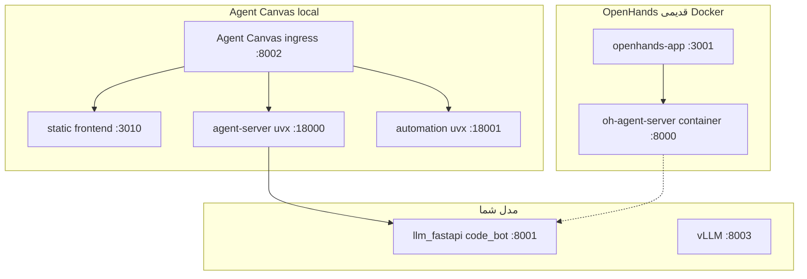

# Agent Canvas vs agent-server — چرا جدا به نظر می‌رسند؟

راهنمای تیم برای درک stack روی سرور GPU.

---

## جواب کوتاه

**بله، جدا هستند — ولی این طبیعی است.** Agent Canvas خودش UI است؛ agent-server موتور backend است. Canvas هنگام start، agent-server را **خودکار** با `uvx` بالا می‌آورد (نیازی به نصب دستی جدا ندارید).

مشکل رایج این است که **دو stack کامل هم‌زمان** روی ماشین باشد: یکی قدیمی (OpenHands Docker) و یکی جدید (Agent Canvas local).

---

## آنچه روی سرور است



| جزء | نصب / اجرا | پورت | نقش |
|-----|------------|------|-----|
| **@openhands/agent-canvas** | `npm install -g` | **8002** (UI اصلی) | UI + ingress + راه‌انداز سرویس‌ها |
| **agent-server (uvx)** | خودکار توسط Canvas | **18000** | API agent (فایل، bash، conversation) |
| **automation (uvx)** | خودکار توسط Canvas | **18001** | workflow/automation |
| **static frontend** | داخل npm package | **3010** | فایل‌های UI |
| **openhands-app** | Docker (قدیمی) | **3001** | UI قدیمی OpenHands |
| **oh-agent-server** | Docker (قدیمی) | **8000** | sandbox قدیمی |

---

## چرا agent-server «جدا» به نظر می‌رسد؟

Agent Canvas معماری **چند لایه** دارد:

1. **agent-canvas** (Node.js) — دستور `agent-canvas` در ترمینال
2. هنگام اجرا، با **uvx** پکیج Python `openhands-agent-server` را دانلود و روی `:18000` اجرا می‌کند
3. UI از npm package سرو می‌شود و از طریق ingress به agent-server وصل می‌شود

یعنی فقط **یک بار** `npm install -g @openhands/agent-canvas` نصب می‌شود؛ agent-server جداگانه نصب نمی‌کنید — Canvas آن را on-demand می‌کشد (اولین بار ممکن است ~۳۰ ثانیه طول بکشد).

**تفاوت با OpenHands Docker:**

| | OpenHands Docker | Agent Canvas local |
|--|------------------|-------------------|
| UI | `openhands-app` container | npm `@openhands/agent-canvas` |
| agent-server | کانتینر `ghcr.io/openhands/agent-server` | process محلی با uvx |
| workspace | mount Docker + permission | مستقیم روی host |

---

## کدام را استفاده کنید؟

| هدف | استفاده کنید |
|-----|--------------|
| کار روی `LLM_SERVER` بدون دردسر permission | **Agent Canvas** → `http://127.0.0.1:8002` |
| setup قدیمی / تست sandbox Docker | OpenHands → `http://127.0.0.1:3001` |

**توصیه:** برای کار روزمره فقط **Agent Canvas** را باز کنید. OpenHands را لازم نیست stop کنید مگر RAM کم باشد.

راه‌اندازی Canvas: [AGENT_CANVAS_SETUP_FA.md](AGENT_CANVAS_SETUP_FA.md)

---

## پوشه‌های داده

| مسیر | محتوا |
|------|--------|
| `~/.openhands/` | settings، profiles، LLM (مشترک بین OpenHands و Canvas) |
| `~/.agent-canvas/` | state، logs، conversations محلی Canvas |

اگر `~/.openhands` مالک **root** باشد (از Docker قدیمی)، اسکریپت `run_agent_canvas.sh` با Docker `chown` اصلاح می‌کند.

---

## خاموش کردن OpenHands قدیمی (اختیاری)

برای آزاد کردن پورت‌های `3001` و `8000`:

```bash
./scripts/stop_openhands.sh
```

Agent Canvas روی `8002` / `18000` ادامه می‌دهد.

---

## جمع‌بندی

> **Agent Canvas = UI + launcher**؛ **agent-server = موتور backend** که Canvas خودش با uvx بالا می‌آورد. جدا بودنشان باگ نیست. برای کار جدید فقط `:8002` را استفاده کنید.
