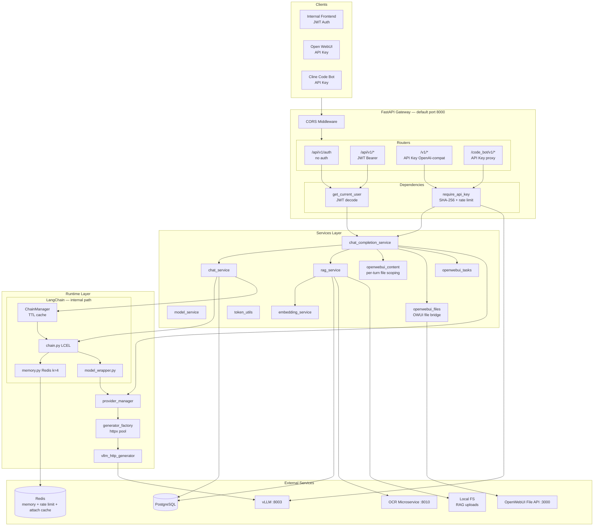
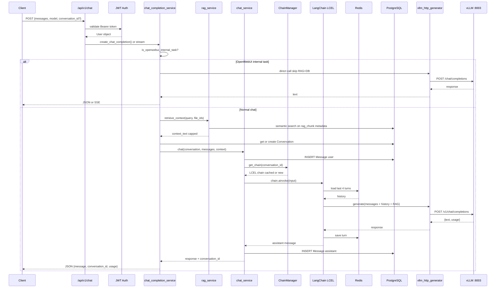
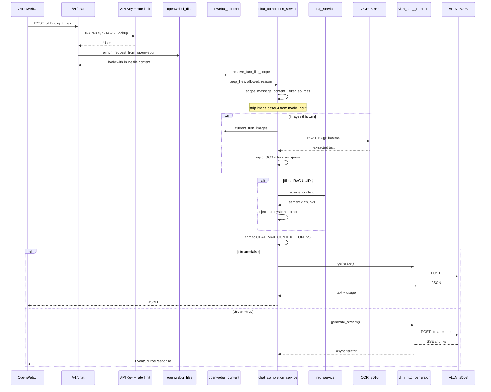
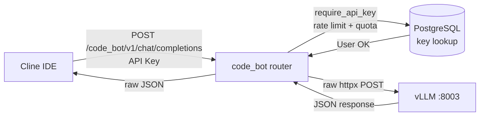
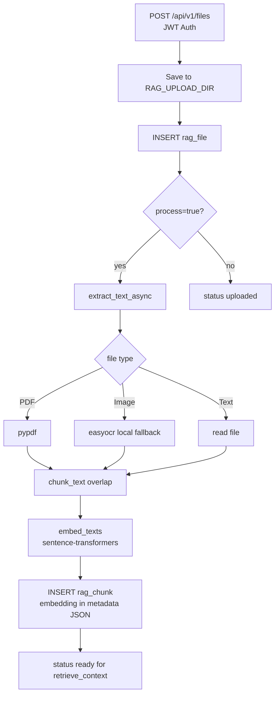
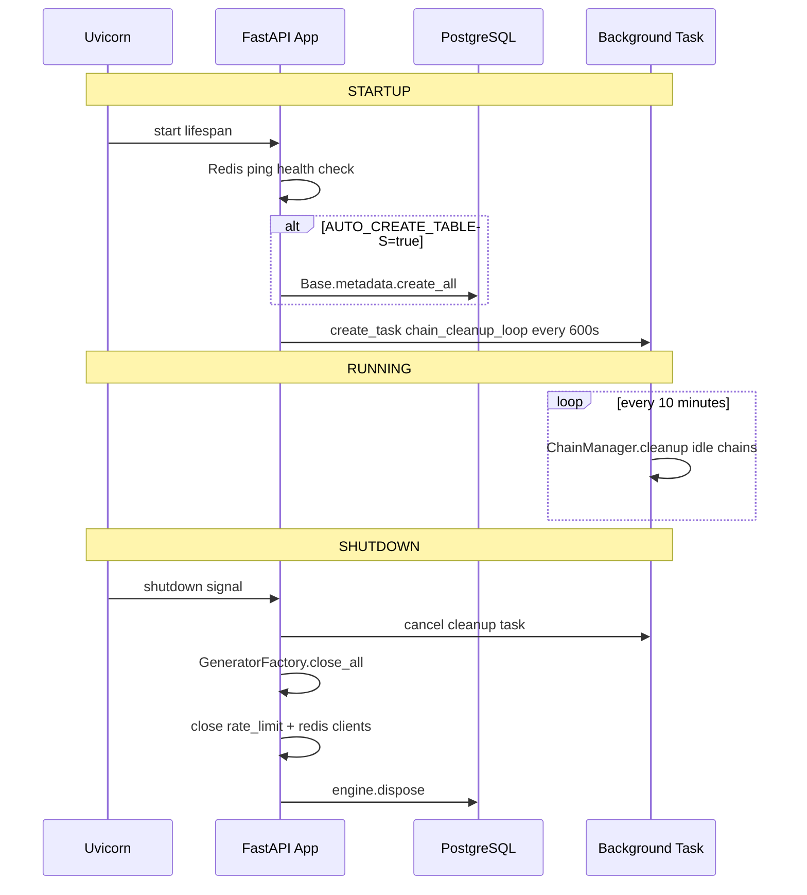
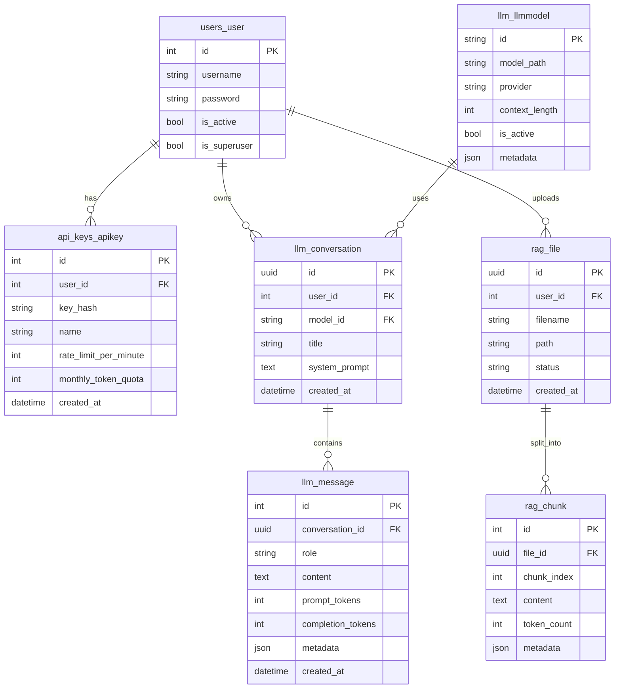
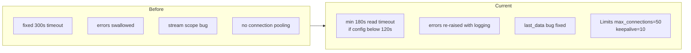

# معماری و جریان کاری — llm_fastapi

مستند مهندسی نرم‌افزار برای Gateway چت و RAG. نمودارهای منبع در `docs/diagrams/` قرار دارند.

---

## خلاصه پروژه

**llm_fastapi** یک **LLM API Gateway** ناهمزمان (async) بر پایه FastAPI است که:

- سه سطح سرویس‌دهی مجزا دارد (JWT داخلی، OpenAI-compatible، Code Bot proxy)
- به vLLM محلی (پورت ۸۰۰۳) متصل می‌شود
- PostgreSQL + Redis به‌عنوان لایه داده استفاده می‌کند
- OpenWebUI را با scoping فایل per-turn و OCR برای تصاویر پشتیبانی می‌کند

پروژه از یک Django monolith مهاجرت کرده؛ رد پای آن در نام جداول (`users_user`, `api_keys_apikey`) باقی است.

---

## Stack فناوری

| لایه | فناوری |
|------|--------|
| Web | FastAPI + Uvicorn (ASGI، کاملاً async) |
| ORM | SQLAlchemy 2.0 async + asyncpg → PostgreSQL |
| Auth | JWT (`python-jose`) + SHA-256 API Key + legacy Django PBKDF2 |
| LLM Orchestration | LangChain LCEL (مسیر داخلی `/api/v1`) |
| Chat Memory | Redis — LangChain buffer window `k=4` |
| LLM Inference | vLLM (OpenAI-compatible HTTP) |
| RAG Embedding | `sentence-transformers` (paraphrase-multilingual-MiniLM-L12-v2) |
| RAG Extract | pypdf + easyocr (fallback) + OCR microservice برای چت |
| HTTP Client | httpx (async, connection pooling) |
| Cache | Redis — rate limit, quota, attachment delta, OCR cache |

---

## معماری لایه‌بندی شده



**منبع:** `docs/diagrams/layered-architecture.mmd`

---

## پورت‌ها و سرویس‌های خارجی

| سرویس | پورت پیش‌فرض | نقش |
|--------|-------------|-----|
| llm_fastapi | 8000 (`main.py`) | Gateway — ممکن است در deploy روی 8001 |
| vLLM | 8003 | Inference (Qwen3-Coder-30B) |
| OpenWebUI | 3000 (container 8080) | UI + فایل‌ها |
| OCR microservice | 8010 | استخراج متن از تصویر |
| Redis | 6379 | Memory, rate limit, attachment cache |
| PostgreSQL | 5432 | Users, chats, RAG |

---

## جریان کاری — چهار مسیر اصلی

### مسیر A — چت داخلی با حافظه و RAG

`POST /api/v1/chat/completions` — JWT، LangChain، Redis memory، PostgreSQL.



**منبع:** `docs/diagrams/workflow-internal.mmd`

---

### مسیر B — OpenAI-Compatible (OpenWebUI)

`POST /v1/chat/completions` — API Key، بدون LangChain memory، با file scoping و OCR.



**منبع:** `docs/diagrams/workflow-openai.mmd`

#### دلایل scoping (`resolve_turn_file_scope`)

| reason | معنی |
|--------|------|
| `request.files` | فایل صریح در payload |
| `last-msg-fresh-source` | `<source>` جدید در آخرین پیام |
| `last-msg-image-focused` | پرسش عکس‌محور — فقط تصاویر جدید |
| `new-images:N` | فقط عکس جدید، بدون PDF قدیمی |
| `conv-delta` | تفاوت با Redis attachment cache |
| `last-msg-inline-file` | PDF inline بدون تگ source |
| `carrier-merge` | merge از پیام حامل |
| `no-attach` | نوبت بدون فایل |

---

### مسیر C — Code Bot Proxy

`POST /code_bot/v1/chat/completions` — بدون RAG، بدون LangChain، مستقیم به vLLM.



**منبع:** `docs/diagrams/workflow-codebot.mmd`

---

### مسیر D — RAG File Ingestion

`POST /api/v1/files` — JWT، ذخیره، chunk، embed، retrieve.



**منبع:** `docs/diagrams/workflow-rag.mmd`

---

## چرخه عمر برنامه (Lifespan)



**منبع:** `docs/diagrams/lifespan.mmd`

---

## مدل داده (ERD)



**منبع:** `docs/diagrams/erd.mmd`

Embedding بردارها در `rag_chunk.metadata_.embedding` (JSON) ذخیره می‌شوند، نه ستون جدا.

---

## ماژول‌ها و توابع کلیدی

### `chat_completion_service.py`

| تابع | نقش |
|------|-----|
| `create_openai_chat_completion_stream` | مسیر اصلی OpenWebUI (SSE) |
| `create_chat_completion` | مسیر داخلی JWT |
| `_to_openai_messages_async` | Scoping، OCR، merge، hints |
| `_prepare` | مدل، RAG، token budget |
| `_ocr_image_url` | فراخوانی OCR microservice |
| `_trim_messages_to_budget` | محدود به `CHAT_MAX_CONTEXT_TOKENS` |

### `openwebui_content.py`

| تابع | نقش |
|------|-----|
| `resolve_turn_file_scope` | `(keep_files, allowed, reason)` |
| `current_turn_images` | تصاویر همین نوبت (بدون Redis) |
| `filter_sources` | فیلتر `<source>` + strip base64 |
| `scope_message_content` | اعمال scoping روی یک پیام |
| `attachments_delta_for_conversation` | delta ضمائم در Redis |

### `openwebui_files.py`

| تابع | نقش |
|------|-----|
| `enrich_request_from_openwebui` | واکشی محتوای فایل از OWUI API |
| `resolve_owui_chat_id` | استخراج chat_id از header |

### `rag_service.py`

| تابع | نقش |
|------|-----|
| `create_rag_file` | آپلود فایل |
| `ingest_rag_file` | chunk + embed |
| `retrieve_context` | جستجوی semantic + lexical |
| `ocr_base64_image` | OCR via microservice + cache |

### `vllm_http_generator.py`

| تابع | نقش |
|------|-----|
| `generate` | Non-streaming به vLLM |
| `generate_stream` | SSE streaming |

---

## vllm_http_generator — بهبودها



جزئیات: `docs/VLLM_HTTP_GENERATOR.md`

---

## نقاط قوت و ضعف معماری

### نقاط قوت

- کاملاً async — بدون blocking thread
- سه سطح سرویس با احراز هویت مستقل
- Provider abstraction — تعویض vLLM / OpenAI
- Singleton cache برای httpx clients و LangChain chains
- RAG semantic با sentence-transformers + fallback lexical
- Per-turn file scoping برای OpenWebUI (تاریخچه کامل در هر درخواست)
- OCR ایزوله — مدل متنی بدون vision
- Rate limit و quota روی API Key (`enforce_rate_limit`, `enforce_quota`)
- 87 unit test

### بدهی فنی / ریسک

- `create_all` در startup وقتی `AUTO_CREATE_TABLES=true` (dev) — production باید Alembic
- `DEFAULT_SECRET_KEY` در config — باید در production تغییر کند
- `DEBUG=True` پیش‌فرض
- کدهای comment شده زیاد در `chat_completion_service.py`
- Redis fail-open برای rate limit — اگر Redis down باشد محدودیت اعمال نمی‌شود
- OWUI بدون `chat_id` در header — collision risk در attachment cache

---

## مستندات مرتبط

- [PROJECT_REPORT_FA.md](./PROJECT_REPORT_FA.md) — گزارش اجرایی فارسی
- [LOAD_TESTING.md](./LOAD_TESTING.md) — راهنمای Locust و ظرفیت ۱۵–۲۰ کاربر
- [VLLM_HTTP_GENERATOR.md](./VLLM_HTTP_GENERATOR.md) — جزئیات کلاینت vLLM
- [../README.md](../README.md) — نصب و endpoints

---

## تولید PNG از نمودارها

```bash
# با mermaid-cli (اختیاری)
npx @mermaid-js/mermaid-cli -i docs/diagrams/layered-architecture.mmd -o docs/images/architecture-overview.png
```
