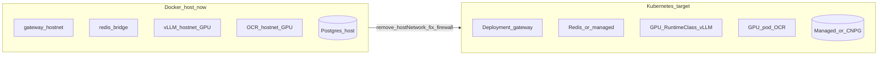

# مستند استقرار Docker و آمادگی Kubernetes — llm_fastapi

**تاریخ به‌روزرسانی:** ۲۲ ژوئیه ۲۰۲۶

---

## ۱. وضعیت فعلی استک

| سرویس | محل | شبکه | وضعیت هدف |
|--------|------|------|-----------|
| **gateway** (`llm_proxy`) | Docker | `network_mode: host` · `:8001` | پایدار |
| **redis** | Docker | bridge · `6379` | پایدار + volume AOF |
| **vLLM** | Docker + NVIDIA | host · `:8003` | پایدار (نیاز به GPU) |
| **OCR** | Docker + NVIDIA | host · `:8010` | پایدار (نیاز به GPU) |
| **PostgreSQL** | **host systemd** · `127.0.0.1:5432` | — | **عمداً خارج از Docker** |
| Open WebUI / OpenHands | Docker جدا | — | خارج از این compose |

فایل اصلی: [`docker-compose.yml`](../docker-compose.yml)  
آزمایش bridge (غیرفعال تا رفع فایروال): [`docker-compose.bridge.yml`](../docker-compose.bridge.yml)

---

## ۲. تصمیم دیتابیس (Postgres)

**الان روی host (systemd) است.** برای K8s فاز اول: **StatefulSet ساده** داخل `team-b` — **بدون CloudNativePG**.

| گزینه | توصیه |
|--------|--------|
| Host Postgres (فعلی) | تا قبل از migration |
| StatefulSet ساده در K8s | فاز اول تیم — مانیفست‌ها در `k8s/team-b/` |
| CloudNativePG / managed | فاز بعدی production |

قبل از هر جابه‌جایی: `./scripts/k8s_pg_dump_host.sh`

---

## ۳. تلاش bridge برای gateway و مانع فعلی

پلن می‌خواست gateway کم‌کم از `host` به **bridge** برود (شبیه Service DNS در K8s).

روی این ماشین (۲۲ ژوئیه ۲۰۲۶) از داخل شبکهٔ `llm_fastapi_default` هیچ TCP به IPهای host (`172.16.40.188`، `172.17.0.1`، `172.19.0.1`) روی پورت‌های `5432` / `8003` / `8010` برقرار نشد — یعنی **فایروال / سیاست docker→host** مانع است.

پیامد:

- gateway روی bridge نمی‌تواند به vLLM/OCR (host network) یا Postgres (`127.0.0.1`) برسد
- Unix socket Postgres از container وصل می‌شود ولی `peer` auth برای user داخل کانتینر fail می‌شود

بنابراین **gateway فعلاً روی host network مانده** تا سرویس قطع نشود. overlay آماده‌شده: `docker-compose.bridge.yml`.

### پیش‌نیاز فعال‌سازی bridge

یکی از این‌ها:

1. اجازهٔ INPUT/FORWARD برای ترافیک از bridgeهای Docker به پورت‌های host، **یا**
2. `listen_addresses` و `pg_hba.conf` طوری که subnet داکر با password auth وصل شود، **و** vLLM/OCR هم از host network خارج شوند (پورت publish + GPU device)

سپس:

```bash
docker compose -f docker-compose.yml -f docker-compose.bridge.yml up -d gateway
```

اسکریپت کمکی: [`scripts/docker_gateway_entrypoint.sh`](../scripts/docker_gateway_entrypoint.sh)

---

## ۴. ایمیج gateway و Alembic

- [`Dockerfile`](../Dockerfile) خروجی `admin/dist` و `alembic/` را کپی می‌کند
- **`alembic/versions/` دیگر در `.dockerignore` نیست** تا migrationها داخل ایمیج باشند

### ساخت ایمیج لوکال (Docker host)

```bash
docker build -t llm_proxy:latest .
docker compose up -d gateway
```

### بردن ایمیج به Kubernetes (Container کپی نمی‌شود)

**اصل:** Pod جدید از Image ساخته می‌شود؛ container در حال اجرا migrate نمی‌شود.

| ایمیج | فاز ۱ `team-b` |
|--------|----------------|
| `postgres:16-alpine` / `redis:7-alpine` | نود از رجیستری عمومی pull می‌کند |
| `llm_proxy` | باید push یا offline import شود |
| `vllm` / `ocr_service` | فعلاً روی Docker host می‌مانند |

**مسیر A — رجیستری (ترجیح):**

```bash
REGISTRY=registry.company.local/llm TAG=1.0.0 ./scripts/k8s_push_gateway_image.sh
# سپس در k8s/team-b/kustomization.yaml:
# images:
#   - name: llm_proxy
#     newName: registry.company.local/llm/llm_proxy
#     newTag: "1.0.0"
```

اگر رجیستری private است: Secret نمونه [`33-gateway-imagepullsecret.yaml.example`](../k8s/team-b/33-gateway-imagepullsecret.yaml.example) و uncomment کردن `imagePullSecrets` در Deployment.

**مسیر B — بدون رجیستری (فقط تست روی یک worker):**

```bash
./scripts/k8s_save_gateway_image.sh
# scp tar به worker-s01 → ctr -n k8s.io images import ...
# در 32-gateway-deployment.yaml: nodeName: worker-s01
```

---

## ۵. مسیر Kubernetes — چه می‌شود؟



### نسبتاً آسان
- gateway → Deployment + Service + Secret از `.env`
- redis → Deployment/StatefulSet یا managed Redis
- Ingress/TLS جلوی gateway و Open WebUI

### سخت / نیاز به طراحی
| مورد | کار لازم |
|------|----------|
| vLLM GPU | NVIDIA device plugin، `nvidia.com/gpu`، PVC مدل |
| OCR GPU | همان؛ سهم VRAM با vLLM روی یک نود |
| `network_mode: host` | حذف؛ DNS داخلی (`http://vllm:8003`) |
| OpenHands / Agent Canvas | جدا نگه دارید یا بازنویسی |

### چک‌لیست قبل از K8s

1. [ ] GPU پایدار (`nvidia-smi` + vLLM/OCR healthy)
2. [ ] RBAC در `team-b` برای Secret/Service/PVC/StatefulSet
3. [ ] ایمیج `llm_proxy` قابل pull توسط کلاستر (registry)
4. [ ] dump از host Postgres
5. [ ] vLLM/OCR فعلاً روی Docker host؛ IP در ConfigMap درست باشد
6. [ ] bypass تونل v2ray برای CIDRهای داخلی (پایین)

---

## ۶. مانیفست‌های آماده‌شده — namespace `team-b`

مسیر: [`k8s/team-b/`](../k8s/team-b/)

| فایل | نقش |
|------|-----|
| `11-postgres-statefulset.yaml` | Postgres 16 + PVC 20Gi + Service `postgres` |
| `20-redis.yaml` | Redis + PVC + Service `redis` |
| `30-gateway-configmap.yaml` | VLLM/OCR روی IP هاست Docker |
| `32-gateway-deployment.yaml` | Gateway + Service `gateway` |
| `*.yaml.example` | Secretها — کپی و پر کنید (gitignored) |

### چک RBAC

```bash
./scripts/k8s_rbac_check.sh team-b
```

### بعد از باز شدن دسترسی ادمین

```bash
cd ~/llm_fastapi

# 1) Secretها
cp k8s/team-b/10-postgres-secret.yaml.example k8s/team-b/10-postgres-secret.yaml
cp k8s/team-b/31-gateway-secret.yaml.example k8s/team-b/31-gateway-secret.yaml
# پسوردها و SECRET_KEY را ویرایش کنید؛ DATABASE_URL باید @postgres:5432 باشد

# در kustomization.yaml خطوط secret را uncomment کنید

# 2) ایمیج gateway را برسانید (یکی از دو راه)
REGISTRY=registry.example.com/llm TAG=1.0.0 ./scripts/k8s_push_gateway_image.sh
# یا: ./scripts/k8s_save_gateway_image.sh  + import روی worker

# 3) apply
kubectl apply -k k8s/team-b/
kubectl -n team-b get pods,svc,pvc

# 4) انتقال داده از host
./scripts/k8s_pg_dump_host.sh
./scripts/k8s_pg_restore_to_pod.sh backups/llm_server_*.dump

# 5) تست
kubectl -n team-b port-forward svc/gateway 8001:8001
curl -sf http://127.0.0.1:8001/health
```

### تونل v2ray / sing-box

اگر TUN روشن است، برای LAN و Docker و Pod CIDR bypass بگذارید، مثلاً:

`127.0.0.0/8`, `10.0.0.0/8`, `172.16.40.0/24`, `172.17.0.0/16`, `172.19.0.0/16`

---

## ۷. دستورهای عملیاتی روزمره (Docker host)

```bash
cd ~/llm_fastapi

# وضعیت
docker compose ps
curl -sf http://127.0.0.1:8001/health
curl -sf http://127.0.0.1:8003/v1/models | head -c 200

# لاگ
docker logs llm_fastapi_gateway --tail 100
docker logs llm_fastapi_vllm --tail 100

# اگر GPU گم شد (مثلاً بعد از reboot بدون passthrough)
nvidia-smi
docker compose up -d vllm ocr gateway
```

---

## ۸. جمع‌بندی یک‌خطی

- Docker host الان پایدار است؛ مانیفست K8s برای `team-b` آماده است و **تا RBAC ادمین apply نمی‌شود**.
- Postgres فاز اول = StatefulSet ساده؛ CloudNativePG لازم نیست.
- vLLM/OCR فعلاً روی host می‌مانند و از ConfigMap به IP ماشین اشاره می‌کنند.
