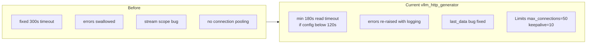

# vllm_http_generator — تغییرات و طراحی

ماژول: `app/runtime/vllm_http_generator.py`

کلاینت async httpx برای ارتباط با vLLM در فرمت OpenAI-compatible.

---

## مسئولیت

- `generate()` — درخواست non-streaming
- `generate_stream()` — AsyncIterator توکن‌ها برای SSE
- لاگ ورودی/خروجی با تخمین توکن
- مدیریت timeout و connection pool

---

## تغییرات نسبت به نسخه قبلی

| جنبه | قبل | الان |
|------|-----|------|
| Read timeout | ثابت 300s یا نامشخص | حداقل 180s اگر config < 120s |
| خطاها | گاهی swallow | `raise_for_status` + re-raise با log |
| Stream | bug در last chunk | last_data bug fix |
| Connection pool | بدون limit | `max_connections=50`, `keepalive=10` |
| Logging | محدود | input_chars, estimated tokens, finish_reason |

---

## نمودار

منبع: `docs/diagrams/vllm-generator.mmd`

---

## پیکربندی مرتبط

| متغیر env | پیش‌فرض | توضیح |
|-----------|---------|--------|
| `VLLM_BASE_URL` | `http://127.0.0.1:8003/v1` | endpoint vLLM |
| `VLLM_REQUEST_TIMEOUT` | `300.0` | سقف timeout (حداقل effective 180s) |
| `VLLM_DEFAULT_MODEL` | path به Qwen3-Coder | model id در payload |

---

## جریان non-stream

1. ساخت payload: `model`, `messages`, `max_tokens`, `temperature`, `stream=false`
2. `POST {base_url}/chat/completions`
3. parse `choices[0].message.content` + `usage`
4. return `{text, usage}`

## جریان stream

1. `stream=true` در payload
2. خواندن SSE خطوط `data: {...}`
3. yield محتوای delta از هر chunk
4. لاگ `chunks` و `total_chars` در پایان

---

## وابستگی‌ها

- `httpx.AsyncClient` — singleton per generator instance
- `app.services.token_utils.estimate_message_tokens` — لاگ تشخیصی
- `app.config.get_settings` — URL و timeout
