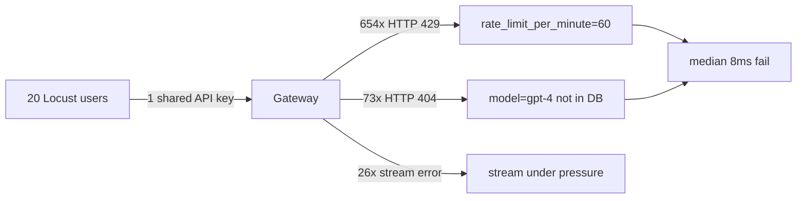

# گزارش فنی — تست بار Locust

**تاریخ:** ۱۹ ژوئن ۲۰۲۶  
**سیستم:** `llm_fastapi` gateway (پورت ۸۰۰۱) → vLLM (پورت ۸۰۰۳)  
**هدف تست:** ۱۵–۲۰ کاربر هم‌زمان روی `/v1/chat/completions`

---

## خلاصه

تست Locust با ۲۰ کاربر هم‌زمان **۹۷٫۳٪ شکست** نشان داد؛ در حالی که latency میانه فقط **۸ms** بود. یعنی درخواست‌ها اصلاً به vLLM نمی‌رسیدند. پس از اصلاح تنظیمات و اسکریپت تست، همان پروفایل **۰٪ شکست** و **۸۱۵ chat موفق** در ۵ دقیقه ثبت شد (median ≈ ۱۸۰ms).

---

## علت مشکل (ریشه‌ای)

سه علت مستقل، به ترتیب اهمیت:



| علت | شواهد | اثر |
|-----|--------|-----|
| **Rate limit** | ۶۵۴× HTTP **429**؛ یک کلید مشترک با سقف پیش‌فرض ۶۰ req/min | بلافاصله رد شدن؛ بدون بار واقعی روی GPU |
| **مدل اشتباه** | ۷۳× HTTP **404**؛ `locustfile` قدیمی `"model": "gpt-4"` می‌فرستاد | در DB فقط `qwen3-coder-30b-a3b-instruct` وجود داشت |
| **Stream** | ۲۶× خطای stream | نویز ثانویه در baseline |

**نکته مهم:** شکست Locust نشانهٔ ضعف vLLM نبود؛ gateway در لایهٔ احراز هویت/محدودیت نرخ درخواست‌ها را قطع می‌کرد.

### آمار اجرای شکست‌خورده (۲۰ کاربر، ~۵ دقیقه)

| معیار | مقدار |
|-------|--------|
| کل درخواست‌ها | ۷۷۴ |
| شکست‌ها | ۷۵۳ (۹۷٫۳٪) |
| Chat موفق | ۰ |
| Median latency | ۸ms |
| ۴۲۹ (rate limit) | ۶۵۴ |
| ۴۰۴ (مدل نامعتبر) | ۷۳ |

---

## چگونه حل شد

| اقدام | فایل/ابزار |
|-------|------------|
| بازنویسی `locustfile.py`: مدل از `/v1/models`، `LOCUST_API_KEY` از env، `wait_time` واقع‌گرایانه، `max_tokens=50`، **فقط non-stream** برای baseline | [`locustfile.py`](../../locustfile.py) |
| غیرفعال‌سازی موقت rate limit در DB برای کلید تست | [`scripts/set_load_test_rate_limit.py`](../../scripts/set_load_test_rate_limit.py) |
| فلگ dev: `LOAD_TEST_DISABLE_RATE_LIMIT=true` | [`app/config.py`](../../app/config.py), [`app/core/rate_limit.py`](../../app/core/rate_limit.py) |
| افزایش pool دیتابیس (`pool_size=20`, `max_overflow=30`) | [`app/database.py`](../../app/database.py) |
| اسکریپت و راهنما | [`scripts/run_locust.sh`](../../scripts/run_locust.sh), [`docs/LOAD_TESTING.md`](../LOAD_TESTING.md) |

### نتیجهٔ تست پس از اصلاح

| معیار | قبل | بعد |
|-------|-----|-----|
| Fail rate | 97.3% | **0%** |
| Chat موفق | 0 | **815** |
| Median latency | 8ms | **180ms** |
| p95 | — | **290ms** |

گزارش HTML نمونه: `locust_report_fixed.html`

### دستور اجرای استاندارد

```bash
export LOCUST_API_KEY=your-api-key
python scripts/set_load_test_rate_limit.py --limit 0   # فقط برای کلید تست

locust -f locustfile.py --host http://127.0.0.1:8001 \
  --users 20 --spawn-rate 4 --run-time 5m --headless \
  --html locust_report.html
```

---

## آیا حل شد؟

| بخش | وضعیت |
|-----|--------|
| تشخیص و اصلاح علت | **بله — در محیط تست تأیید شد** |
| commit در git | **خیر — تغییرات Locust هنوز commit نشده** (`locustfile.py` untracked، `rate_limit.py` modified) |
| production | **نیاز به اقدام:** `rate_limit_per_minute` برای کلیدهای واقعی در DB احتمالاً روی ۰ مانده؛ باید به مقدار منطقی (مثلاً ۱۲۰–۳۰۰) برگردد |
| ظرفیت ۱۵–۲۰ کاربر با پاسخ بلند | **فقط برای `max_tokens` کوتاه تأیید شد**؛ برای `max_tokens` ۵۱۲–۴۰۹۶ باید vLLM (`max-num-seqs`) tune شود |

### جمع‌بندی

مشکل تست **حل شده**؛ محدودیت واقعی سیستم برای پاسخ‌های طولانی هنوز vLLM/GPU است، نه gateway.

### اقدامات باقی‌مانده

1. بازگرداندن `rate_limit_per_minute` کلیدهای production پس از پایان تست بار
2. commit تغییرات Locust در git
3. تست مجدد با `max_tokens` واقع‌گرایانه (۵۱۲+) برای SLA واقعی

---

## مراجع

- [LOAD_TESTING.md](../LOAD_TESTING.md) — راهنمای کامل Locust
- [ARCHITECTURE.md](../ARCHITECTURE.md) — معماری gateway و rate limit
