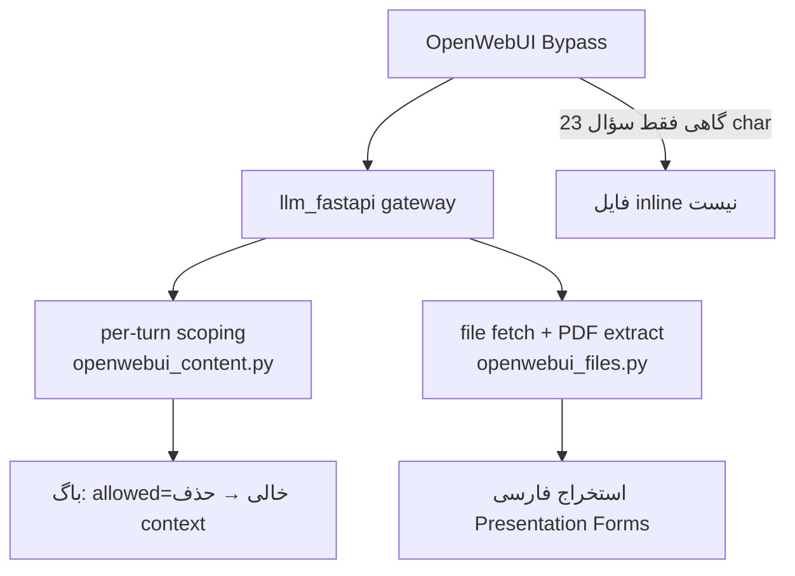

# گزارش فنی — خواندن PDF در مسیر OpenWebUI

**تاریخ:** ۱۴–۱۹ ژوئن ۲۰۲۶  
**مسیر داده:** OpenWebUI (:3000) → Gateway `llm_fastapi` (:8001) → vLLM (:8003)  
**مدل:** `qwen3-coder-30b-a3b-instruct`

---

## خلاصه

در مسیر OpenWebUI → Gateway، PDF گاهی اصلاً به مدل نمی‌رسید (`prompt_tokens≈42`)، گاهی با متن فارسی **خراب** (حروف Presentation Form مثل `ﻋﻨﺪﺍﻟﻤﻄﺎﻟﺒﻪ`)، و در آخرین مورد (مقاله انگلیسی ~۱۱۳K کاراکتر) محتوا **شناسایی می‌شد ولی قبل از ارسال به vLLM حذف** می‌شد.

---

## علت مشکل (چند لایه)



### لایه ۱ — فایل به gateway نمی‌رسد

- OpenWebUI فایل را در `:3000` نگه می‌دارد؛ بدون Bypass ممکن است فقط سؤال متنی فوروارد شود (`msg_lens` کوچک، `owui_refs=[]`).
- لاگ نمونه:

```
msg_lens=[4, 68, 23]
owui_refs=[]
prompt_tokens=42 | last_chars=23 | rag_chars=0
```

### لایه ۲ — متن فارسی PDF خراب

- استخراج OpenWebUI/pypdf برای PDFهای فارسی با فونت‌های خاص → **Arabic Presentation Forms** (حروف جدا و غیرقابل‌خواندن برای مدل).
- نمونه کاربر:

```
7211427989824453 ﻋﻨﺪﺍﻟﻤﻄﺎﻟﺒﻪ بانک توسعه تعاون ...
```

- پس از NFKC باید به شکل خوانا تبدیل شود:

```
عندالمطالبه بانك توسعه تعاون ... محمد معظمی گودرزی ...
```

### لایه ۳ — باگ scoping (مقاله انگلیسی، ۱۹ ژوئن)

- OWUI ~۱۱۳٬۸۷۰ کاراکتر inline با `<source>` (بدون `name`/`id`) فرستاد.
- `resolve_turn_file_scope` درست تشخیص داد: `reason=last-msg-inline-file`, `keep_files=True`.
- ولی `_scope_plain_text` وقتی `allowed_names` خالی بود، `filter_sources(text, set())` را صدا می‌زد و **کل `<context>` را حذف** می‌کرد.

**لاگ قطعی:**

```
msg_lens=[4, 68, 113870]
reason=last-msg-inline-file | keep_files=True | files=none
raw_in_msg=1 [?=113686c] → kept_for_model=0 [no-source-tags]
prompt_tokens=42 | input_chars=95
```

یعنی: محتوا در payload بود، scoping آن را حذف کرد، فقط سؤال کوتاه (~۲۳ کاراکتر) به vLLM رفت.

---

## چگونه حل شد

| مشکل | راه‌حل | فایل |
|------|--------|------|
| واکشی فایل وقتی OWUI فقط ref می‌فرستد | `enrich_request_from_openwebui`, `fetch_openwebui_file_text`, `resolve_openwebui_file_refs` | [`app/services/openwebui_files.py`](../../app/services/openwebui_files.py) |
| per-turn scoping (فایل قدیمی، OCR، چند فایل) | `resolve_turn_file_scope`, `filter_sources` | [`app/services/openwebui_content.py`](../../app/services/openwebui_content.py) |
| فارسی Presentation Forms | NFKC (`_normalize_document_text`) + تشخیص متن خراب (`_broken_arabic_pdf_text`) + استخراج مجدد با pypdf از bytes خام | [`app/services/openwebui_files.py`](../../app/services/openwebui_files.py) |
| حذف اشتباه inline با `<source>` | اگر `keep_files=True` و نوبت جاری: `allowed=خالی` = نگه‌داشتن کل محتوا، نه strip | [`app/services/openwebui_content.py`](../../app/services/openwebui_content.py) (خطوط 187–194) |
| نرمال inline بدون fetch | `_normalize_sources_in_markup` روی `<source>`های موجود در پیام | [`app/services/openwebui_files.py`](../../app/services/openwebui_files.py) |
| تست واحد | ۵۳+ تست شامل `test_inline_owui_source_kept_when_keep_files_and_empty_allowed` | [`tests/test_openwebui_content.py`](../../tests/test_openwebui_content.py), [`tests/test_openwebui_files.py`](../../tests/test_openwebui_files.py) |

### پیش‌نیازهای OpenWebUI

| تنظیم | مقدار |
|--------|--------|
| Bypass Embedding and Retrieval | **ON** |
| Full Context Mode | **ON** (پیشنهادی) |
| `OPENWEBUI_BASE_URL` | آدرس OWUI در `.env` gateway |
| `OPENWEBUI_API_KEY` | کلید API با دسترسی فایل |
| `ENABLE_FORWARD_USER_INFO_HEADERS` | فعال در OWUI |

### آخرین commit مرتبط در git

- `5f61a34` — `fix: stabilize OpenWebUI OCR and per-turn file scoping for mixed attachments`
- اصلاحات PDF جدید (NFKC، pypdf fallback، باگ scoping) **هنوز uncommitted**

---

## آیا حل شد؟

| زیرمشکل | وضعیت |
|---------|--------|
| Scoping — حذف PDF انگلیسی inline | **اصلاح کد انجام شد + تست واحد سبز** — نیاز به restart gateway و تست دستی کاربر |
| فارسی Presentation Forms | **اصلاح کد انجام شد** — NFKC متن نمونه را خوانا می‌کند؛ تأیید نهایی روی PDF واقعی بانک **pending** |
| فایل اصلاً نمی‌رسد (Bypass خاموش / OWUI ناپایدار) | **تا حدی** — bridge و fetch کمک می‌کند؛ اگر OWUI فقط ۲۳ کاراکتر بفرستد و ref ندهد، به تنظیمات OWUI وابسته است |
| commit در git | **خیر** — تغییرات `openwebui_content.py` و `openwebui_files.py` هنوز commit نشده |

### چک‌لیست لاگ پس از restart (نشانهٔ موفقیت)

```
📎 Sources | raw_in_msg=1 [...] → kept_for_model=1 [...]   # نه kept_for_model=0
prompt_tokens >> 42   # برای PDF بزرگ باید هزاران توکن باشد
📄 PDF re-extracted via pypdf | ...   # در صورت نیاز فارسی
📥 Fetched OpenWebUI file ... | chars=...   # اگر fetch از OWUI انجام شود
```

### جمع‌بندی

از نظر کد، **سه مسیر اصلی شناسایی و patch شده**. وضعیت عملیاتی = **نیمه‌حل‌شده** تا زمان restart gateway و یک تست موفق کاربر روی PDF فارسی و انگلیسی.

### اقدامات باقی‌مانده

1. restart gateway پس از deploy تغییرات
2. تست PDF فارسی (صورت‌حساب بانک) و انگلیسی (مقاله)
3. ضمیمهٔ لاگ موفق به این گزارش
4. commit تغییرات PDF در git
5. (در صورت شکست pypdf روی فارسی) بررسی OCR روی صفحات PDF به‌عنوان fallback

---

## مراجع

- [ARCHITECTURE.md](../ARCHITECTURE.md) — workflow OpenWebUI و per-turn scoping
- [PROJECT_REPORT_FA.md](../PROJECT_REPORT_FA.md) — گزارش اجرایی پروژه
